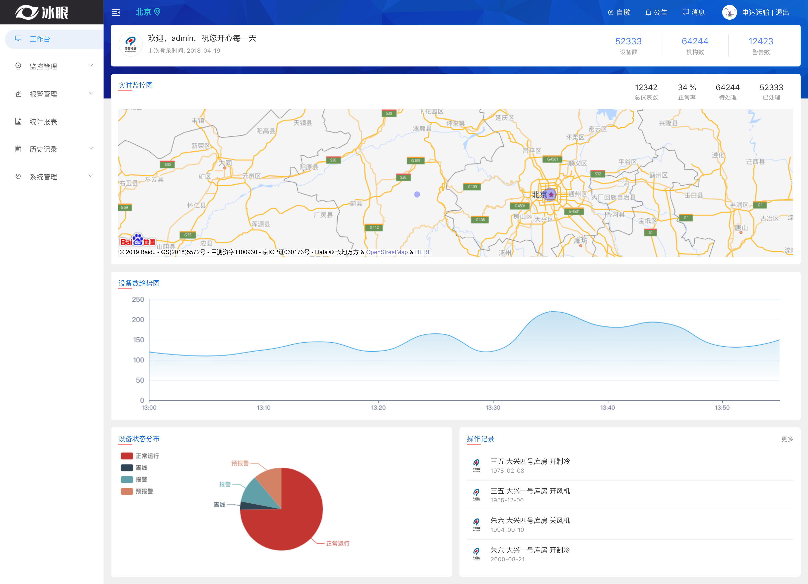

## 冷链 - 后台管理

## 编译vue
npm install
## 本地运行web应用
npm run serve
## 生成dist目录
npm run build

## 技术栈
- vue + elementUI + typeScript

## 相关信息

 - git http://git.itcast.cn/development/project-coldChain-java-vue-ts.git
 
 - mock https://mock.boxuegu.com/project/470/interface/api/9011
 ## 页面
 
 ## 项目结构
 
 -- views -  主页面   
    -- dashboard - index.vue 工作台  
    --monitoring 监控记录 
       -- realTime.vue - 实时监控  
       -- storehouse.vue - 仓储监控  
    -- callPolice - 报警管理 
        -- callPoliceSet.vue - 报警配置 
        -- realTimeCallPolice.vue - 实时报警 
        -- callPoliceLog - 报警记录 
    -- Statistics - index.vue 统计报表 
    -- historyLog 历史记录 
        -- storehouseCallPoliceLog.vue -  仓储报警记录 
        -- storehouseHistoryLog.vue - 仓储历史记录 
    -- admin - 系统管理     
        -- company.vue 企业管理 
        -- storehouse.vue 库房管理 
        -- host.vue 主机管理 
        -- meter.vue 仪表管理 
    -- login - 登录     

参考文档：

typescript: https://www.tslang.cn/docs/handbook/basic-types.html
elementUI: https://element.eleme.io/#/zh-CN/component
vue-element-admin:  https://panjiachen.github.io/vue-element-admin-site/zh/guide/
vue-baidu-map: https://dafrok.github.io/vue-baidu-map/#/zh/map/baidu-map

